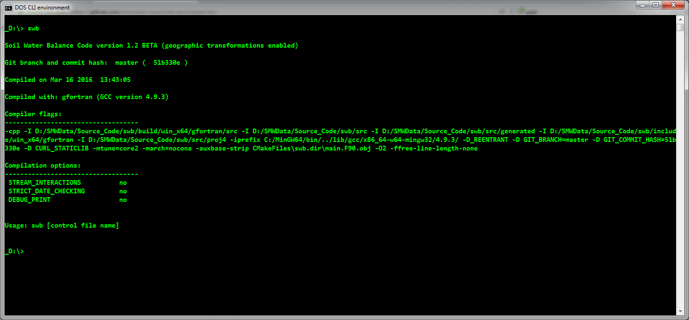

# NOTICE

The executables provided here have not received approval from the USGS and represent work-in-progress. Use at your own risk. Please consider filing an issue on this GitHub page if you find a bug.

Information about the SWB executable you are using may always be found by running swb.exe at the command line with no arguments:

```
swb
```

The current version available here reports the following version information:



Note that the Git branch and commit hash associated with the executable are reported. You may use the GitHub tools to view the Git repository and code as it existed when this specific version of the code was compiled. 
