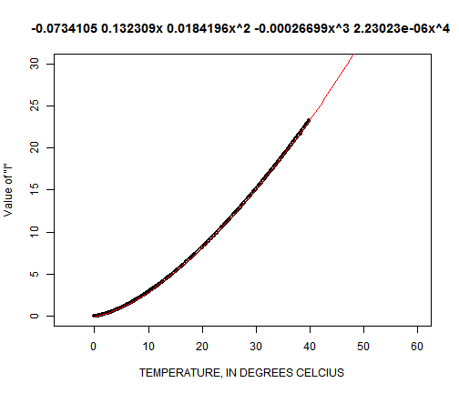

Equation-fitting: Table 2, Thornthwaite and Mather (1957)
========================================================

This documents the process of fitting a general equation to Table 2 of Thornthwaite and Mather (1957). Table 2 is entitled "Monthly Values of I Corresponding to Monthly Mean Temperatures (degrees C)." This equation fitting exercise is designed as a check of the regression equations coded into the original version of SWB.

The first step is to define the general form of the equation we wish to use to summarize the Thornthwaite-Mather tables. The original version of SWB defines this table with a quartic (4th degree) polynomial:

```r
gen <- function(x, const, fac1, fac2, fac3, fac4) {
    
    pred <- const + fac1 * x + fac2 * x^2 + fac3 * x^3 + fac4 * x^4
    return(pred)
}
```


The next code block reads in the data from Thornthwaite and Mather (1957), Table 2. 


```r
load("D:\\SMWData\\Source_Code\\swb\\share\\Table_summaries\\TM_Table_2\\TM_Table_2.RData")
TM_2 <- data.frame(Temp_degC = numeric(), I = numeric())

mycolnames <- colnames(TM_table_2)[2:ncol(TM_table_2)]
x <- as.numeric(gsub(pattern = "T", replacement = "", x = mycolnames))
y <- TM_table_2[, 1]
```


Table 2 in Thornthwaite and Mather (1957) is laid out such that the successive column numbers (0-9) correspond to the number after the decimal, like this:

Temperature in degrees C |.0 | .1| .2  |.3 | .4
----------|---|---|-----|---|----
0| .00| .00 |.01|.01|.02
1 |.09 | .10|.12|.13|.15
2 | .25| .27|.29|.31|.33

In the table above, the "I" value that corresponds to a temperature of 1.4 degrees C would be 0.15. The next code block rearranges the table to account for this.


```r
for (i in seq(1, 10)) {
    Temp_degC <- y + x[i]/10
    I <- TM_table_2[, i + 1]
    
    temp_df <- data.frame(Temp_degC = Temp_degC, I = I)
    TM_2 <- rbind(TM_2, temp_df)
    
    
}

# sort in ascending order
TM_2C <- TM_2[order(TM_2[, 1]), ]
TM_2C_newdata <- data.frame(Temp_degC = seq(0, 50), I = numeric(length(seq(0, 
    50))))
TM_2F <- data.frame(Temp_degF = TM_2C$Temp_degC * 9/5 + 32, I = TM_2C$I)
TM_2F_newdata <- data.frame(Temp_degF = seq(32, 140), I = numeric(length(seq(32, 
    140))))
```


Now let's use nonlinear least squares to estimate parameters.


```r

TM_2C_opt <- nls(I ~ gen(Temp_degC, const, fac1, fac2, fac3, fac4), data = TM_2C, 
    start = list(const = 0, fac1 = 0.5, fac2 = 0.3, fac3 = 0.1, fac4 = 0.05), 
    control = list(maxiter = 3000, tol = 1e-07, printEval = TRUE, minFactor = 1e-08, 
        warnOnly = TRUE))

params_table_2 <- as.numeric(TM_2C_opt$m$getPars())

equation_table_2 <- paste(signif(params_table_2[1], digits = 6), " ", signif(params_table_2[2], 
    digits = 6), "x ", signif(params_table_2[3], digits = 6), "x^2 ", signif(params_table_2[4], 
    digits = 6), "x^3 ", signif(params_table_2[5], digits = 6), "x^4 ", sep = "")


TM_2F_opt <- nls(I ~ gen(Temp_degF, const, fac1, fac2, fac3, fac4), data = TM_2F, 
    start = list(const = 0, fac1 = 0.5, fac2 = 0.3, fac3 = 0.1, fac4 = 0.05), 
    control = list(maxiter = 3000, tol = 1e-07, printEval = TRUE, minFactor = 1e-08, 
        warnOnly = TRUE))

params_table_1 <- as.numeric(TM_2F_opt$m$getPars())

equation_table_1 <- paste(signif(params_table_1[1], digits = 6), " ", signif(params_table_1[2], 
    digits = 6), "x ", signif(params_table_1[3], digits = 6), "x^2 ", signif(params_table_1[4], 
    digits = 6), "x^3 ", signif(params_table_1[5], digits = 6), "x^4 ", sep = "")
```


The regression for table 1 (degrees Fahrenheit) looks like this:

 


The regression for table 2 (degrees Celcius) looks like this:

 

