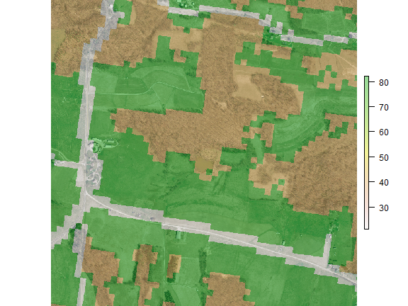
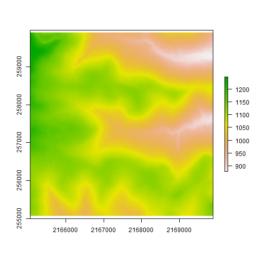
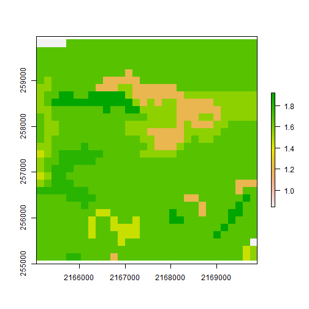
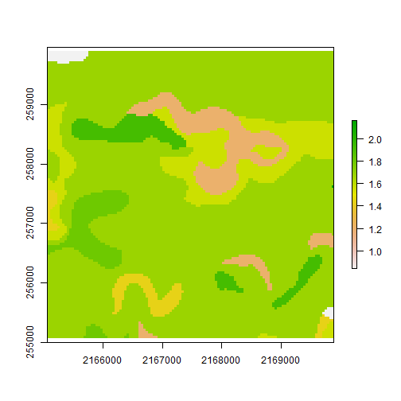
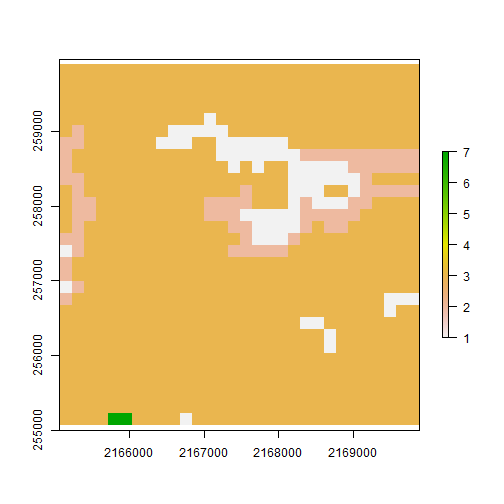

SWB: Basic Grid Preparation
========================================================

There are many tools and techniques that may be used to prepare basic
grids for use with SWB. This document shows how the open-source package 'R'
may be used to quickly prepare the necessary grids.

----------------
The first step in using R for this task is to load the necessary libraries needed to read and write shape, image, and grid files.


```r

library(rgdal)
library(raster)
```


Next we define the path to the directory where the GIS data resides.

```r
dataDir <- "D:/SMWData/Source_Code/SWB_TEST_CASES/Coshocton/Data_Prep/GIS"
setwd("D:/SMWData/Source_Code/SWB_TEST_CASES/Coshocton/Data_Prep")
```

Now we can begin loading the data files. 

Elevation
----------------

### READ DATA
The elevation dataset was obtained from the Ohio Statewide Imagery Program website at
http://gis3.oit.ohio.gov/geodata/  

```r

elev <- readGDAL(paste(dataDir, "elevation/N2165255.txt", sep = "/"))
```

```
## D:/SMWData/Source_Code/SWB_TEST_CASES/Coshocton/Data_Prep/GIS/elevation/N2165255.txt has GDAL driver AAIGrid 
## and has 2000 rows and 2000 columns
```

### DEFINE PROJECTION
The data are in the Ohio State Plane North projection with horizontal distance units of *feet*. We need to define this projection by setting the "PROJ4" string. (PROJ4 is a program originally developed by a USGS researcher to facilitate reprojection of spatial data). Basic projection information may be found at http://spatialreference.org


```r
# define the coordinate reference system (crs) parameters for Ohio State
# Plane
crsOhioStatePlane <- paste("+proj=lcc", "+lat_1=40.43333333333333", "+lat_2=41.7", 
    "+lat_0=39.66666666666666", "+lon_0=-82.5", "+x_0=600000.0", "+y_0=0.0", 
    "+ellps=GRS80", "+datum=NAD83", "+to_meter=0.304800", "+towgs84=0,0,0")

proj4string(elev) <- crsOhioStatePlane

# create a 'raster' version of the elev dataset
elevRaster <- raster(elev)
```

Land Use
-------------------
### READ DATA
The landuse dataset is the 2006 version of the National Land Cover Database (NLCD), and was obtained via the USGS National Map viewer:
http://viewer.nationalmap.gov/viewer/  

```r
lulc <- readGDAL(paste(dataDir, "NLCD/98678813.tif", sep = "/"))
```

```
## D:/SMWData/Source_Code/SWB_TEST_CASES/Coshocton/Data_Prep/GIS/NLCD/98678813.tif has GDAL driver GTiff 
## and has 225 rows and 251 columns
```

### DEFINE PROJECTION
A custom Albers Conic Equal Area is used to define the projection for this dataset. Horizontal distance units are *meters*. The projection information for this dataset is read in properly; there is no need to call 'proj4string'.


```r
# create a 'raster' version of the 'lulc' dataset
lulcRaster <- raster(lulc)
lulcRasterOHSP <- projectRaster(from = lulcRaster, to = elevRaster, method = "ngb")
```


Soils
----------------

The basic soils data were obtained through the NRCS's Soil Data Mart: 
http://soildatamart.nrcs.usda.gov/ The NRCS Soil Data Viewer extension for ArcGIS was used to extract available water content and hydrologic soil group information from the soils database and export them as ESRI shapefiles. 
### READ DATA

```r
soils_AWC <- readOGR(dsn = paste(dataDir, "soils", sep = "/"), layer = "AWC_cm_per_cm_OH_State_Plane_N_ft")
```

```
## OGR data source with driver: ESRI Shapefile 
## Source: "D:/SMWData/Source_Code/SWB_TEST_CASES/Coshocton/Data_Prep/GIS/soils", layer: "AWC_cm_per_cm_OH_State_Plane_N_ft"
## with 17802 features and 6 fields
## Feature type: wkbPolygon with 2 dimensions
```

```r

soils_HSG <- readOGR(dsn = paste(dataDir, "soils", sep = "/"), layer = "Hydrologic_Soil_Groups_OH_State_Plane_ft")
```

```
## OGR data source with driver: ESRI Shapefile 
## Source: "D:/SMWData/Source_Code/SWB_TEST_CASES/Coshocton/Data_Prep/GIS/soils", layer: "Hydrologic_Soil_Groups_OH_State_Plane_ft"
## with 196 features and 8 fields
## Feature type: wkbPolygon with 2 dimensions
```

### DEFINE PROJECTION
The projection information for these two datasets was set upon export from ArcGIS to be consistent with Ohio State Plane North (feet). Since the projection information for these datasets is read in properly there is no need to call 'proj4string'.

Digital Orthophoto
-------------------

### READ DATA
The digital orthophoto dataset was obtained from the Ohio Statewide Imagery Program website at
http://gis3.oit.ohio.gov/geodata/  

```r

dop <- readGDAL(paste(dataDir, "DOP/n2165255.tif", sep = "/"))
```

```
## D:/SMWData/Source_Code/SWB_TEST_CASES/Coshocton/Data_Prep/GIS/DOP/n2165255.tif has GDAL driver GTiff 
## and has 5000 rows and 5000 columns
```

```r
dopRasterStack <- stack(dop)
```


Let's plot up the rasters and shapefiles:


```r
plotRGB(dopRasterStack)
plot(lulcRasterOHSP, alpha = 0.4, add = TRUE)
```

 


Next let's define three resolutions for the grids we'll use with SWB.


```r
coarse <- raster(nrows = 30, ncols = 30, xmn = 2165054, xmx = 2169887, ymn = 255067, 
    ymx = 259900, crs = CRS(crsOhioStatePlane))
medium <- raster(nrows = 60, ncols = 60, xmn = 2165054, xmx = 2169887, ymn = 255067, 
    ymx = 259900, crs = CRS(crsOhioStatePlane))
fine <- raster(nrows = 120, ncols = 120, xmn = 2165054, xmx = 2169887, ymn = 255067, 
    ymx = 259900, crs = CRS(crsOhioStatePlane))
```


Next, we use the newly defined rasters as the common baseline to which the 
rasters are resampled, and the vectors are 'rasterized'.


```r

lulcCoarse <- resample(lulcRasterOHSP, coarse, method = "ngb")
```

```
## Warning: you are resampling y a raster with a much larger cell size,
## perhaps you should use "aggregate" first
```

```r
lulcMedium <- resample(lulcRasterOHSP, medium, method = "ngb")
```

```
## Warning: you are resampling y a raster with a much larger cell size,
## perhaps you should use "aggregate" first
```

```r
lulcFine <- resample(lulcRasterOHSP, fine, method = "ngb")
```

```
## Warning: you are resampling y a raster with a much larger cell size,
## perhaps you should use "aggregate" first
```

```r

elevCoarse <- resample(elevRaster, coarse, method = "ngb")
```

```
## Warning: you are resampling y a raster with a much larger cell size,
## perhaps you should use "aggregate" first
```

```r
elevMedium <- resample(elevRaster, medium, method = "ngb")
```

```
## Warning: you are resampling y a raster with a much larger cell size,
## perhaps you should use "aggregate" first
```

```r
elevFine <- resample(elevRaster, fine, method = "ngb")
```

```
## Warning: you are resampling y a raster with a much larger cell size,
## perhaps you should use "aggregate" first
```

```r

plot(elevCoarse)
```

 

```r
plot(elevMedium)
```

 

```r
plot(elevFine)
```

 


The function "terrain" from the R raster package looked promising, but yields incorrect D8 flow direction grids. Here we write all of the newly created grids to disk. ArcGIS was then used on the elevation grids to produce the D8 flow direction grids.


```r
flowdirCoarse <- terrain(elevCoarse, opt = "flowdir")

awcCoarse <- rasterize(soils_AWC, coarse, field = "AWC") * 12
```

```
## Found 17802 region(s) and 18839 polygon(s)
```

```r
awcMedium <- rasterize(soils_AWC, medium, field = "AWC") * 12
```

```
## Found 17802 region(s) and 18839 polygon(s)
```

```r
awcFine <- rasterize(soils_AWC, fine, field = "AWC") * 12
```

```
## Found 17802 region(s) and 18839 polygon(s)
```

```r

plot(awcCoarse)
```

 

```r
plot(awcMedium)
```

 

```r
plot(awcFine)
```

 

```r

hsgCoarse <- rasterize(soils_HSG, coarse, field = "HydGrpNum")
```

```
## Found 196 region(s) and 215 polygon(s)
```

```r
hsgMedium <- rasterize(soils_HSG, medium, field = "HydGrpNum")
```

```
## Found 196 region(s) and 215 polygon(s)
```

```r
hsgFine <- rasterize(soils_HSG, fine, field = "HydGrpNum")
```

```
## Found 196 region(s) and 215 polygon(s)
```

```r

plot(hsgCoarse)
```

 

```r
plot(hsgMedium)
```

 

```r
plot(hsgFine)
```

 

```r

flowdirCoarse <- terrain(elevCoarse, opt = "flowdir")
flowdirMedium <- terrain(elevMedium, opt = "flowdir")
flowdirFine <- terrain(elevFine, opt = "flowdir")

writeRaster(elevCoarse, filename = paste(dataDir, "elevation/elevCoarse.asc", 
    sep = "/"), type = "FLT4S", format = "ascii", overwrite = TRUE)
```

```
## class       : RasterLayer 
## dimensions  : 30, 30, 900  (nrow, ncol, ncell)
## resolution  : 161.1, 161.1  (x, y)
## extent      : 2165054, 2169887, 255067, 259900  (xmin, xmax, ymin, ymax)
## coord. ref. : NA 
## values      : D:\SMWData\Source_Code\SWB_TEST_CASES\Coshocton\Data_Prep\GIS\elevation\elevCoarse.asc 
## layer name  : elevCoarse 
## 
```

```r

writeRaster(elevMedium, filename = paste(dataDir, "elevation/elevMedium.asc", 
    sep = "/"), type = "FLT4S", format = "ascii", overwrite = TRUE)
```

```
## class       : RasterLayer 
## dimensions  : 60, 60, 3600  (nrow, ncol, ncell)
## resolution  : 80.55, 80.55  (x, y)
## extent      : 2165054, 2169887, 255067, 259900  (xmin, xmax, ymin, ymax)
## coord. ref. : NA 
## values      : D:\SMWData\Source_Code\SWB_TEST_CASES\Coshocton\Data_Prep\GIS\elevation\elevMedium.asc 
## layer name  : elevMedium 
## 
```

```r

writeRaster(elevFine, filename = paste(dataDir, "elevation/elevFine.asc", sep = "/"), 
    type = "FLT4S", format = "ascii", overwrite = TRUE)
```

```
## class       : RasterLayer 
## dimensions  : 120, 120, 14400  (nrow, ncol, ncell)
## resolution  : 40.27, 40.27  (x, y)
## extent      : 2165054, 2169887, 255067, 259900  (xmin, xmax, ymin, ymax)
## coord. ref. : NA 
## values      : D:\SMWData\Source_Code\SWB_TEST_CASES\Coshocton\Data_Prep\GIS\elevation\elevFine.asc 
## layer name  : elevFine 
## 
```

```r

writeRaster(hsgCoarse, filename = paste(dataDir, "soils/hsgCoarse.asc", sep = "/"), 
    type = "INT1U", format = "ascii", overwrite = TRUE)
```

```
## class       : RasterLayer 
## dimensions  : 30, 30, 900  (nrow, ncol, ncell)
## resolution  : 161.1, 161.1  (x, y)
## extent      : 2165054, 2169887, 255067, 259900  (xmin, xmax, ymin, ymax)
## coord. ref. : NA 
## values      : D:\SMWData\Source_Code\SWB_TEST_CASES\Coshocton\Data_Prep\GIS\soils\hsgCoarse.asc 
## layer name  : hsgCoarse 
## min value   : -2.147e+09 
## max value   : 2.147e+09 
## 
```

```r

writeRaster(hsgMedium, filename = paste(dataDir, "soils/hsgMedium.asc", sep = "/"), 
    type = "INT1U", format = "ascii", overwrite = TRUE)
```

```
## class       : RasterLayer 
## dimensions  : 60, 60, 3600  (nrow, ncol, ncell)
## resolution  : 80.55, 80.55  (x, y)
## extent      : 2165054, 2169887, 255067, 259900  (xmin, xmax, ymin, ymax)
## coord. ref. : NA 
## values      : D:\SMWData\Source_Code\SWB_TEST_CASES\Coshocton\Data_Prep\GIS\soils\hsgMedium.asc 
## layer name  : hsgMedium 
## min value   : -2.147e+09 
## max value   : 2.147e+09 
## 
```

```r

writeRaster(hsgFine, filename = paste(dataDir, "soils/hsgFine.asc", sep = "/"), 
    type = "INT1U", format = "ascii", overwrite = TRUE)
```

```
## class       : RasterLayer 
## dimensions  : 120, 120, 14400  (nrow, ncol, ncell)
## resolution  : 40.27, 40.27  (x, y)
## extent      : 2165054, 2169887, 255067, 259900  (xmin, xmax, ymin, ymax)
## coord. ref. : NA 
## values      : D:\SMWData\Source_Code\SWB_TEST_CASES\Coshocton\Data_Prep\GIS\soils\hsgFine.asc 
## layer name  : hsgFine 
## min value   : -2.147e+09 
## max value   : 2.147e+09 
## 
```

```r

writeRaster(awcCoarse, filename = paste(dataDir, "soils/awcCoarse.asc", sep = "/"), 
    type = "FLT4S", format = "ascii", overwrite = TRUE)
```

```
## class       : RasterLayer 
## dimensions  : 30, 30, 900  (nrow, ncol, ncell)
## resolution  : 161.1, 161.1  (x, y)
## extent      : 2165054, 2169887, 255067, 259900  (xmin, xmax, ymin, ymax)
## coord. ref. : NA 
## values      : D:\SMWData\Source_Code\SWB_TEST_CASES\Coshocton\Data_Prep\GIS\soils\awcCoarse.asc 
## layer name  : awcCoarse 
## 
```

```r

writeRaster(awcMedium, filename = paste(dataDir, "soils/awcMedium.asc", sep = "/"), 
    type = "FLT4S", format = "ascii", overwrite = TRUE)
```

```
## class       : RasterLayer 
## dimensions  : 60, 60, 3600  (nrow, ncol, ncell)
## resolution  : 80.55, 80.55  (x, y)
## extent      : 2165054, 2169887, 255067, 259900  (xmin, xmax, ymin, ymax)
## coord. ref. : NA 
## values      : D:\SMWData\Source_Code\SWB_TEST_CASES\Coshocton\Data_Prep\GIS\soils\awcMedium.asc 
## layer name  : awcMedium 
## 
```

```r

writeRaster(awcFine, filename = paste(dataDir, "soils/awcFine.asc", sep = "/"), 
    type = "FLT4S", format = "ascii", overwrite = TRUE)
```

```
## class       : RasterLayer 
## dimensions  : 120, 120, 14400  (nrow, ncol, ncell)
## resolution  : 40.27, 40.27  (x, y)
## extent      : 2165054, 2169887, 255067, 259900  (xmin, xmax, ymin, ymax)
## coord. ref. : NA 
## values      : D:\SMWData\Source_Code\SWB_TEST_CASES\Coshocton\Data_Prep\GIS\soils\awcFine.asc 
## layer name  : awcFine 
## 
```

