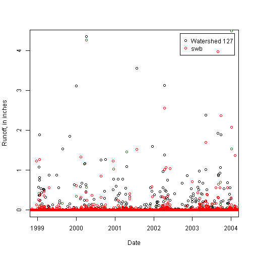
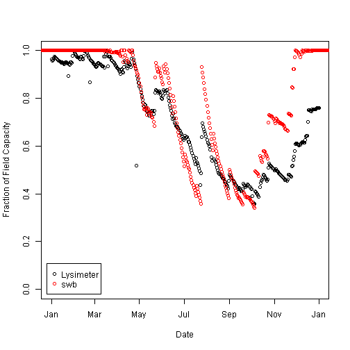
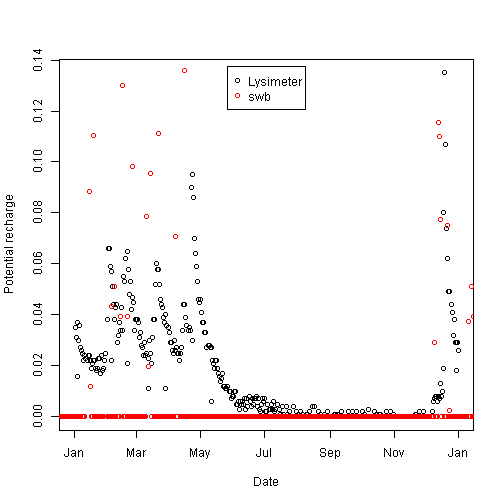

Processing and comparing swb with lysimeter data
========================================================

Load required libraries and read in the Coshocton datasets.

```r
setwd("D:\\SMWData\\Source_Code\\SWB_TEST_CASES\\Coshocton\\Data_Prep")

library(lubridate)
library(doBy)

# set to 'TRUE' if we need to regenerate the swb climate input data files
writeDailyGrids <- FALSE

# Rain gage data from lysimeter 103
prcp <- read.table("rg103.datt", sep = "\t", header = TRUE)

# Runoff data from experimental watershed 172
ro <- read.table("ws172.datt", sep = "\t", header = TRUE)

# Climate data from NCDC
met <- read.table("Coshocton_Meteorological_Data.csv", sep = ",", header = TRUE)

# Lysimeter data - two parts must be concatenated to form a complete
# dataset
lysA <- read.csv("lysim101_2001_partA.csv", header = TRUE)
lysB <- read.csv("lysim101_2001_partB.csv", header = TRUE)
lys <- rbind(lysA, lysB)

# read in the swb-generated RUNOFF values
ssf_ro <- read.table("..\\swb\\OUTFLOW_8_8.ssf", header = FALSE)
colnames(ssf_ro) <- c("obs_name", "date", "time", "value")

# read in the swb-generated SOIL MOISTURE values
ssf_sm <- read.table("..\\swb\\SOIL_MOISTURE_2_10.ssf", header = FALSE)
colnames(ssf_sm) <- c("obs_name", "date", "time", "value")

# read in the swb-generated RECHARGE values
ssf_rchg <- read.table("..\\swb\\RECHARGE_2_10.ssf", header = FALSE)
colnames(ssf_rchg) <- c("obs_name", "date", "time", "value")
```

Next we need to create POSIX-compliant dates, remove missing values,
and make the conversion to degrees F and inches.


```r
prcp$datePOSIX <- dmy(prcp$date)
met$datePOSIX <- ymd(met$DATE)
ro$datePOSIX <- dmy(ro$date)
lys$dateStr <- paste(lys$YEAR, lys$MONTH, lys$DAY, sep = "-")
lys$datePOSIX <- ymd(lys$dateStr)
ssf_ro$datePOSIX <- mdy(ssf_ro$date)
ssf_sm$datePOSIX <- mdy(ssf_sm$date)
ssf_rchg$datePOSIX <- mdy(ssf_rchg$date)

met$TMAX[met$TMAX >= 9999] <- NA
met$TMIN[met$TMIN >= 9999] <- NA
met$PRCP[met$PRCP >= 9999] <- NA
met$EVAP[met$EVAP >= 9999] <- NA
met$WDMV[met$WDMV >= 9999] <- NA
met$SNOW[met$SNOW >= 9999] <- NA
met$SNWD[met$SNWD >= 9999] <- NA

met$TMAX_degF <- (met$TMAX/10) * 9/5 + 32
met$TMIN_degF <- (met$TMIN/10) * 9/5 + 32
met$PRCP_inches <- (met$PRCP/10)/25.4
met$WINDVEL_m_s <- met$WDMV * 1000/86400
met$SNWD_inches <- met$SNWD/25.4
met$SNOW_inches <- met$SNOW/25.4
```

Now we need to aggregate some of the lysimeter and flume data to a 
DAILY time step.


```r
dailyprcp <- summaryBy(DepthIncr ~ datePOSIX, data = prcp, FUN = c(sum))
dailyLysWt <- summaryBy(WEIGHT ~ datePOSIX, data = subset(lys, !is.na(datePOSIX)), 
    FUN = c(mean))
daily_ro <- summaryBy(Flow_iph ~ datePOSIX, data = ro, FUN = c(sum))
```


The next section really should be in it's own function. It is only called
once: when the swb climate files are generated.


```r
if (writeDailyGrids) {
    
    Month <- month(met$datePOSIX)
    Day <- day(met$datePOSIX)
    Year <- year(met$datePOSIX)
    TAVG <- (met$TMIN_degF + met$TMAX_degF)/2
    Precipitation <- met$PRCP_inches
    Avg_Rel_Hum <- rep(-9999, length(Month))
    TMAX <- met$TMAX_degF
    TMIN <- met$TMIN_degF
    WINDVEL <- met$WINDVEL_m_s
    WINDVEL[is.na(WINDVEL)] <- 2
    Min_Rel_Hum <- rep(-9999, length(Month))
    Pct_Sunshine <- rep(-9999, length(Month))
    
    for (i in seq(1956, 2010)) {
        filename <- paste("Coshocton_climate_", i, ".txt", sep = "")
        cat(file = filename, paste("Month", "Day", "Year", "TAVG (F)", "Precipitation (in)", 
            "Avg Rel Hum (%)", "TMAX (F)", "TMIN (F)", "WINDVEL (m/sec)", "Min Rel Hum (%)", 
            "Sunshine", sep = "\t"))
        cat(file = filename, "\n", append = TRUE)
        
        for (j in seq(1, length(Month))) {
            
            if (Year[j] == i) {
                if (is.na(Precipitation[j])) {
                  cat("Missing precip on ", Month[j], Day[j], Year[j], ". Substituting '0.0'\n")
                  Precipitation[j] <- 0
                }
                
                if (is.na(TAVG[j])) {
                  cat("Missing TAVG on ", Month[j], Day[j], Year[j], ". Substituting previous days' value.\n")
                  TAVG[j] <- TAVG[j - 1]
                }
                
                if (is.na(TMIN[j])) {
                  cat("Missing TMIN on ", Month[j], Day[j], Year[j], ". Substituting previous days' value.\n")
                  TMIN[j] <- TMIN[j - 1]
                }
                
                if (is.na(TMAX[j])) {
                  cat("Missing TMAX on ", Month[j], Day[j], Year[j], ". Substituting previous days' value.\n")
                  TMAX[j] <- TMAX[j - 1]
                }
                
                cat(file = filename, Month[j], Day[j], Year[j], TAVG[j], Precipitation[j], 
                  Avg_Rel_Hum[j], TMAX[j], TMIN[j], WINDVEL[j], Min_Rel_Hum[j], 
                  Pct_Sunshine[j], "\n", append = TRUE)
            }
        }
    }
}
```


Let's plot up the experimental watershed 127 runoff against the swb-calculated
values.


```r
plot(ssf_ro$value ~ ssf_ro$datePOSIX, xlab = "Date", ylab = "Runoff, in inches")
points(daily_ro$Flow_iph.sum ~ daily_ro$datePOSIX, col = "red")
legend("topright", legend = c("Watershed 127", "swb"), col = c("black", "red"), 
    pch = c(21, 21), inset = c(0.02, 0.02))
```

 

Now let's compare normalized soil moisture values recorded at the lysimeter with the values calculated by swb.


```r
# normalize by assumuning that field capacity is approximated by the
# maximum value attained during the year
ssf_sm$percentSat <- ssf_sm$value/max(ssf_sm$value, rm.na = TRUE)

# eliminate 'NA' values before plotting
dailyLysWt <- subset(dailyLysWt, !is.na(WEIGHT.mean))
dailyLysWt$percentSat <- dailyLysWt$WEIGHT.mean/max(dailyLysWt$WEIGHT.mean, 
    rm.na = TRUE)

plot(dailyLysWt$percentSat ~ dailyLysWt$datePOSIX, xlab = "Date", ylab = "Fraction of Field Capacity", 
    ylim = c(0, 1), xlim = c(ymd("2001-01-01"), ymd("2001-12-31")))
points(ssf_sm$percentSat ~ ssf_sm$datePOSIX, col = "red")
legend("bottomleft", legend = c("Lysimeter", "swb"), col = c("black", "red"), 
    pch = c(21, 21), inset = c(0.02, 0.02))
```

 

Here's a comparison between the daily percolation out the bottom of the lysimeter with the potential recharge calculated by swb. The swb code jettisons all surplus water in a single day, whereas at the lysimeter site it appears that the surplus water drains out the bottom more slowly.


```r
plot(lys$DAILY.PERC.A ~ lys$datePOSIX, xlab = "Date", ylab = "Potential recharge")
points(ssf_rchg$value ~ ssf_rchg$datePOSIX, col = "red")
legend("top", legend = c("Lysimeter", "swb"), col = c("black", "red"), pch = c(21, 
    21), inset = c(0.02, 0.02))
```

 

