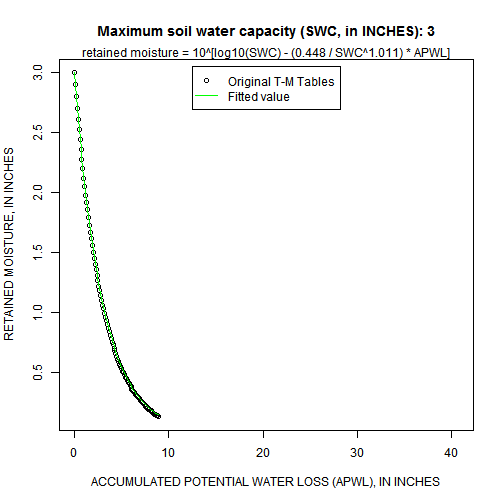
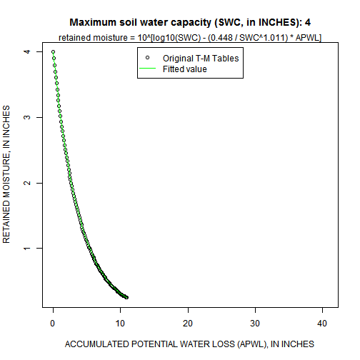
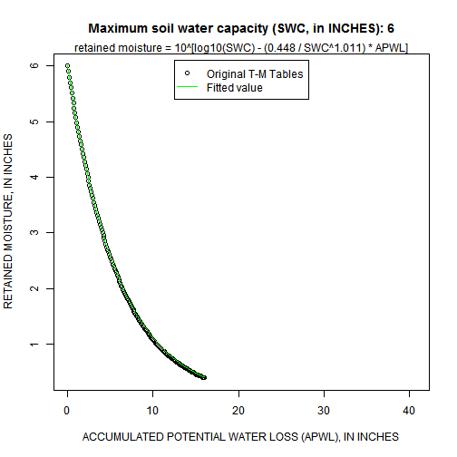
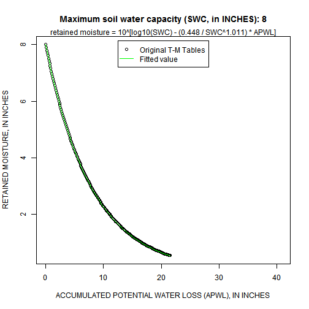
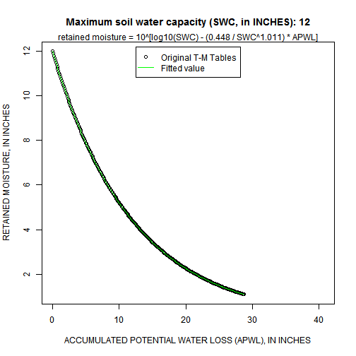
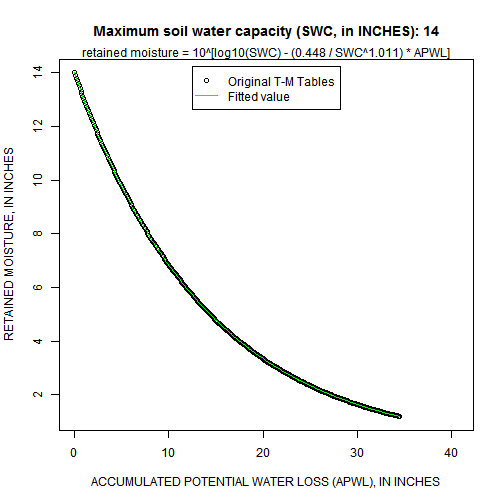
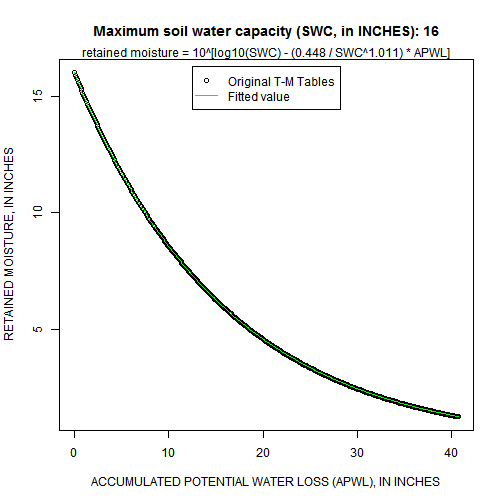

Generalization of the Thornthwaite-Mather Soil-Moisture Retention Tables
========================================================

The original swb model reads in digitized versions of the Thornthwaite-Mather soil-moisture retention tables. We surmised that amount of computing involved in negotiating the lookup tables and interpolating a result was significant enough to warrant generalization. Specifically, we fit a generalized equation to the tables in order that they might eventually be eliminated from the code altogether in the future. This page documents how the generalization functions in swb were developed.

Functional Forms
--------------------------

There are at least two articles in the literature that describe simple relations that may be used to summarize the Thornthwaite-Mather table values. They are essentially the same, varying only in the choice to use the base-10 or natural logarithm in the calculation. These will be used later on in the script to determine the optimum value for the slope and exponent.

The first form of the generalized equation is suggested in: 

Pastor, J. and Post, W.M., 1984, Calculating Thornthwaite and Mather's actual evapotranspiration using an approximating function: Canadian Journal of Forest Research, v. 14, no. 3 (June), p. 466-467.

$$
RM = SWC \cdot {e^{\left( {constant - {\textstyle{{factor} \over {SWC}}}} \right)APWL}}
$$

where:
  RM is the retained moisture,
  SWC is the soil water capacity (or field capacity)

Pastor and Post (1984) reported values of 0.000461 for the value of the constant, and 1.10559 for the factor value.

```r
residual_function_1 <- function(parameters, APWL_values, FC_values, retained_moisture) {
    
    constant <- parameters[1]
    factor <- parameters[2]
    predicted_values <- FC_values * exp((constant - factor/FC_values) * APWL_values)
    residual <- sum((retained_moisture - predicted_values)^2)
    return(residual)
    
}

function_1 <- function(parameters, APWL_values, FC_values) {
    
    constant <- parameters[1]
    factor <- parameters[2]
    predicted_values <- FC_values * exp((constant - factor/FC_values) * APWL_values)
    return(predicted_values)
    
}
```


The second form of the generalized equation is suggested in:

Kolka, R.K. and Wolf, A.T., 1998, Estimating actual evapotranspiration for forested sites: modifications to the Thornthwaite Model: Research Note: U.S. Department of Agriculture, Forest Service, Southern Research Station, accessed August 15, 2012, at http://www.srs.fs.usda.gov/pubs/462.

$$
RM = {10^{\left[ {{{\log }_{10}}(SWC) - \left( {{\textstyle{{constant} \over {SWC^{exponent}}}}} \right)APWL} \right]}}
$$

where
  RM is the retained moisture,
  SWC is the soil water capacity (or field capacity)

Kolka and Wolf (1998) reported values of 0.525 for the value of the constant, and 1.0371 for the value of the exponent.


```r

residual_function_2 <- function(parameters, APWL_values, FC_values, retained_moisture) {
    
    constant <- parameters[1]
    exponent <- parameters[2]
    predicted_values <- 10^(log10(FC_values) - (constant/FC_values^exponent) * 
        APWL_values)
    residual <- sum((retained_moisture - predicted_values)^2)
    return(residual)
    
}

function_2 <- function(parameters, APWL_values, FC_values) {
    
    constant <- parameters[1]
    exponent <- parameters[2]
    predicted_values <- 10^(log10(FC_values) - (constant/FC_values^exponent) * 
        APWL_values)
    return(predicted_values)
    
}
```


Thornthwaite-Mather Table Values
----------------------------------

Next, read in the soil moisture retention table contained in swb. We also give intelligible column and row names to the table. For comparison purposes, both the original and "extended" table values are read in.


```r
moist_retained_swb <- read.table("soil-moisture-retention-extended.grd", skip = 5, 
    header = FALSE)
colnames(moist_retained_swb) <- paste("field_cap_", seq(0.5, 17.5, 0.5), sep = "")
rownames(moist_retained_swb) <- paste("APWL_", seq(0, 40.7, 0.1), sep = "")
```

Next read in the soil moisture retention table summarized from values in the original Thornthwaite and Mather (1957) publication. Note that this table is an abridged version that omits all of Thornthwaite's interpolated values. This summary is based on Tables 11 through 22 of Thornthwaite and Mather (1957), "SOIL MOISTURE RETAINED AFTER DIFFERENT AMOUNTS OF POTENTIAL EVAPOTRANSPIRATION HAVE OCCURRED."


```r
moist_retained_orig <- read.table("Thornthwaite-Mather_Soil_Moisture_ORIGINAL_1957.txt", 
    as.is = TRUE, colClasses = "numeric", header = TRUE)
rownames(moist_retained_orig) <- paste("APWL_", moist_retained_orig[[1]], sep = "")
moist_retained_orig <- moist_retained_orig[, -1]
colnames(moist_retained_orig) <- paste("field_cap_", c(1, 1.5, 2, 3, 4, 5, 6, 
    8, 10, 12, 14, 16), sep = "")
```


Now we'll plot up the tables themselves. The first statements rearrange the soil moisture data into data structures required to plot and process the data.

Note that the accumulated potential water loss term is calculated as:

$$
APWL = \sum\limits_{}^{} {(precip - PET)} 
$$

Therefore, the APWL values shown below should actually be negative values; for convenience, the negative term is dropped.

PLOT: Original Thornthwaite-Mather tables
-------------------------------------


```r

x <- seq(0, 40.7, 0.1)
y <- c(1, 1.5, 2, 3, 4, 5, 6, 8, 10, 12, 14, 16)

retained_moisture_matrix <- as.matrix(moist_retained_orig)

nrows <- dim(retained_moisture_matrix)[[1]]
ncols <- dim(retained_moisture_matrix)[[2]]

APWL_values <- rep(x, ncols)  # APWL values
FC_values <- rep(y, each = nrows)  # Soil Water Capacity (field capacity) values

rm_df <- data.frame(x = APWL_values, y = FC_values, z = as.vector(retained_moisture_matrix))
rm_df <- subset(rm_df, !is.na(z))

image(x, y, retained_moisture_matrix, axes = TRUE, xlab = "ACCUMULATED POTENTIAL WATER LOSS, IN INCHES", 
    ylab = "MAXIMUM SOIL-WATER CAPACITY, IN INCHES", col = rev(rainbow(32, start = 1/6, 
        end = 4/6)))
contour(x, y, retained_moisture_matrix, axes = FALSE, add = TRUE, levels = seq(1, 
    16, 1), col = "red")
box()
```

 


Now we'll use a nonlinear optimization routine to find the parameter values for the two forms of the generalized function value.


```r
opt_values <- optim(par = c(0.001, 1.1), fn = residual_function_1, method = "BFGS", 
    APWL_values = rm_df$x, FC_values = rm_df$y, retained_moisture = rm_df$z)

opt_values2 <- optim(par = c(0.001, -1.1), fn = residual_function_2, method = "BFGS", 
    APWL_values = rm_df$x, FC_values = rm_df$y, retained_moisture = rm_df$z)

rm_df$method1 <- function_1(opt_values$par, APWL_values = rm_df$x, FC_values = rm_df$y)
rm_df$method2 <- function_2(opt_values2$par, APWL_values = rm_df$x, FC_values = rm_df$y)

# first method published parameter values: 0.000461, 1.105591
opt_values$par
```

```
## [1] 0.0007096 1.0119686
```

```r

# second method published parameter values: 0.525, 1.0371
opt_values2$par
```

```
## [1] 0.448 1.011
```

### PLOT: Original table values and generalized function values


```r

for (i in 1:length(y)) {
    
    # plot the ORIGINAL Thornthwaite-Mather table values
    plot(x, retained_moisture_matrix[, i], main = paste("Maximum soil water capacity (SWC, in INCHES):", 
        y[i]), xlab = "ACCUMULATED POTENTIAL WATER LOSS (APWL), IN INCHES", 
        ylab = "RETAINED MOISTURE, IN INCHES")
    # plot the fitted equation
    lines(rm_df$x[rm_df$y == y[i]], rm_df$method2[rm_df$y == y[i]], col = "green")
    
    legend("top", inset = c(0.02, 0.02), pch = c(1, NA), lty = c(NA, 1), col = c("black", 
        "green"), legend = c("Original T-M Tables", "Fitted value"))
    
    mtext(paste("retained moisture = 10^[log10(SWC) - (", sprintf("%5.3f", opt_values2$par[1]), 
        " / SWC^", sprintf("%5.3f", opt_values2$par[2]), ") * APWL]", sep = ""))
    
}
```

            


PLOT: Modified Thornthwaite-Mather tables (as included in swb)
-------------------------------------

The standard soil-moisture retention table included with swb is based on the original Thornthwaite-Mather (1957) tables. There are two major deviations from the original tables; specifically the tables have been:

1. extrapolated so that values exist down to a maximum accumulated potential water loss (APWL) of -40.7 inches;
2. interpolated for maximum soil moisture (field capacity) values that did not appear in the original tables (e.g. for a field capacity of 13 inches).


```r

x <- seq(0, 40.7, 0.1)
y <- seq(0.5, 17.5, 0.5)

retained_moisture_matrix_swb <- as.matrix(moist_retained_swb)

nrows <- dim(retained_moisture_matrix_swb)[[1]]
ncols <- dim(retained_moisture_matrix_swb)[[2]]

APWL_values <- rep(x, ncols)  # APWL values
FC_values <- rep(y, each = nrows)  # Soil Water Capacity (field capacity) values

rm_swb_df <- data.frame(x = APWL_values, y = FC_values, z = as.vector(retained_moisture_matrix_swb))
rm_swb_df <- subset(rm_swb_df, !is.na(z))

image(x, y, retained_moisture_matrix_swb, axes = TRUE, xlab = "ACCUMULATED POTENTIAL WATER LOSS, IN INCHES", 
    ylab = "MAXIMUM SOIL-WATER CAPACITY, IN INCHES", col = rev(rainbow(32, start = 1/6, 
        end = 4/6)))
contour(x, y, retained_moisture_matrix_swb, axes = FALSE, add = TRUE, levels = seq(1, 
    16, 1), col = "red", cex = 1.3)
box()
```

 

```r

opt_values_swb <- optim(par = c(0.001, 1.1), fn = residual_function_1, method = "BFGS", 
    APWL_values = rm_swb_df$x, FC_values = rm_swb_df$y, retained_moisture = rm_swb_df$z)

opt_values_swb2 <- optim(par = c(0.001, 1.1), fn = residual_function_2, method = "BFGS", 
    APWL_values = rm_swb_df$x, FC_values = rm_swb_df$y, retained_moisture = rm_swb_df$z)

rm_swb_df$method1 <- function_1(opt_values_swb$par, APWL_values = rm_swb_df$x, 
    FC_values = rm_swb_df$y)
rm_swb_df$method2 <- function_2(opt_values_swb2$par, APWL_values = rm_swb_df$x, 
    FC_values = rm_swb_df$y)
```


